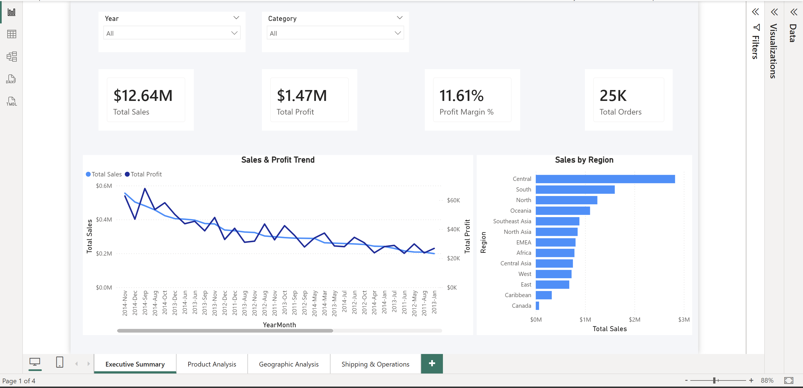
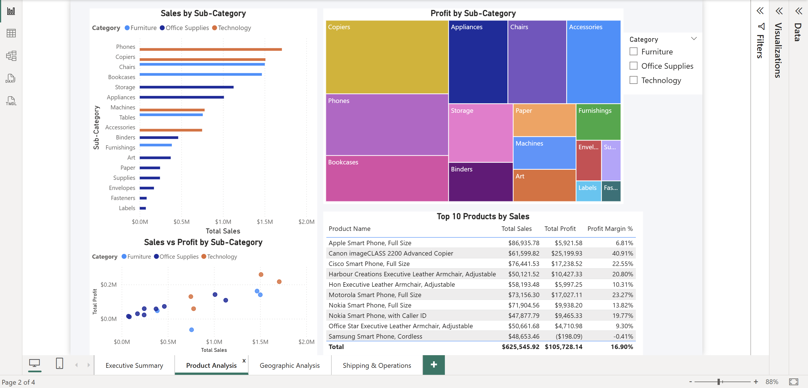
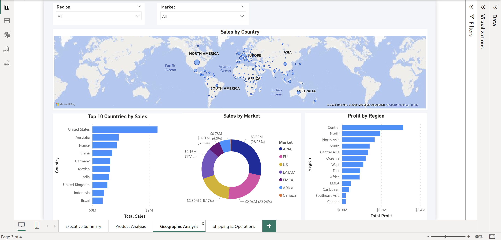
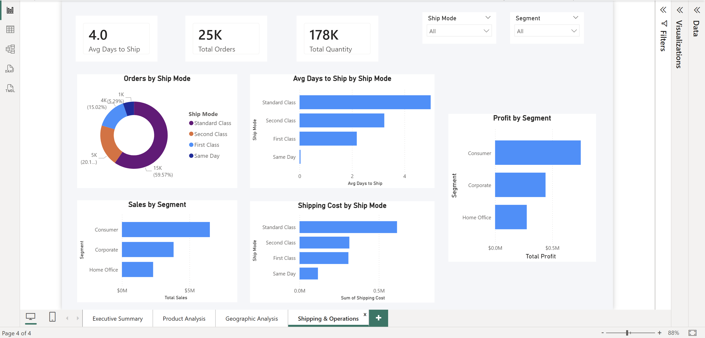

# 🛒 Global Superstore - Retail Sales Dashboard | Power BI

## 📌 Project Overview
An interactive 4-page Power BI dashboard analyzing 51,290 
sales records from the Global Superstore dataset spanning 
2011–2014 across 7 international markets.

---

## 🎯 Objective
To analyze sales performance, identify profitable and 
loss-making product categories, understand regional trends, 
and evaluate shipping efficiency using Power BI.

---

## 🛠️ Tools Used
- **Power BI Desktop** — Dashboard & Visualizations
- **Power Query** — Data Cleaning & Transformation
- **DAX** — Measures & Calculations
- **Dataset** — [Global Superstore | Kaggle](https://www.kaggle.com/datasets/apoorvaappz/global-super-store-dataset)

---

## 📊 Dashboard Pages

### Page 1 — Executive Summary

- KPI Cards: Total Sales, Profit, Margin, Orders
- Sales & Profit Trend Line Chart
- Sales by Region Bar Chart

### Page 2 — Product Analysis

- Sales by Sub-Category
- Profit Treemap
- Sales vs Profit Scatter Plot
- Top 10 Products Table

### Page 3 — Geographic Analysis

- Sales by Country Map
- Top 10 Countries by Sales
- Profit by Region
- Sales by Market

### Page 4 — Shipping & Operations

- Orders by Ship Mode
- Avg Days to Ship by Ship Mode
- Sales & Profit by Segment
- Shipping Cost by Ship Mode

---

## 🔑 Key DAX Measures
```dax
Total Sales = SUM(Orders[Sales])
Total Profit = SUM(Orders[Profit])
Profit Margin % = DIVIDE([Total Profit], [Total Sales], 0)
Total Orders = DISTINCTCOUNT(Orders[Order ID])
Total Quantity = SUM(Orders[Quantity])
Avg Days to Ship = AVERAGE(Orders[Days to Ship])
YoY Sales Growth % = 
VAR CurrentYear = [Total Sales]
VAR PrevYear = CALCULATE([Total Sales], 
               SAMEPERIODLASTYEAR('DateTable'[Date]))
RETURN DIVIDE(CurrentYear - PrevYear, PrevYear, 0)
```

---

## 💡 Key Insights
- 📦 **Technology** generates highest sales but 
  **Office Supplies** has most orders
- 📉 **Tables & Bookcases** are loss-making despite 
  high sales due to heavy discounting
- 🌍 **West region** leads in revenue but **Central** 
  has lowest profit margin
- 🚚 **Standard Class** shipping used for ~60% of 
  orders averaging 5+ days
- 👥 **Consumer segment** accounts for ~50% of sales
- 📈 YoY sales grew but profit margins stayed flat — 
  indicating discount strategy issues

---

## 📂 Files
| File | Description |
|------|-------------|
| `dashboard/Retail Sales Dashboard.pbix` | Power BI File |
| `screenshots/` | Dashboard Page Screenshots |

---

## 👤 Author
Ruthvik Garlapati
📧 ruthvikg18@gmail.com
